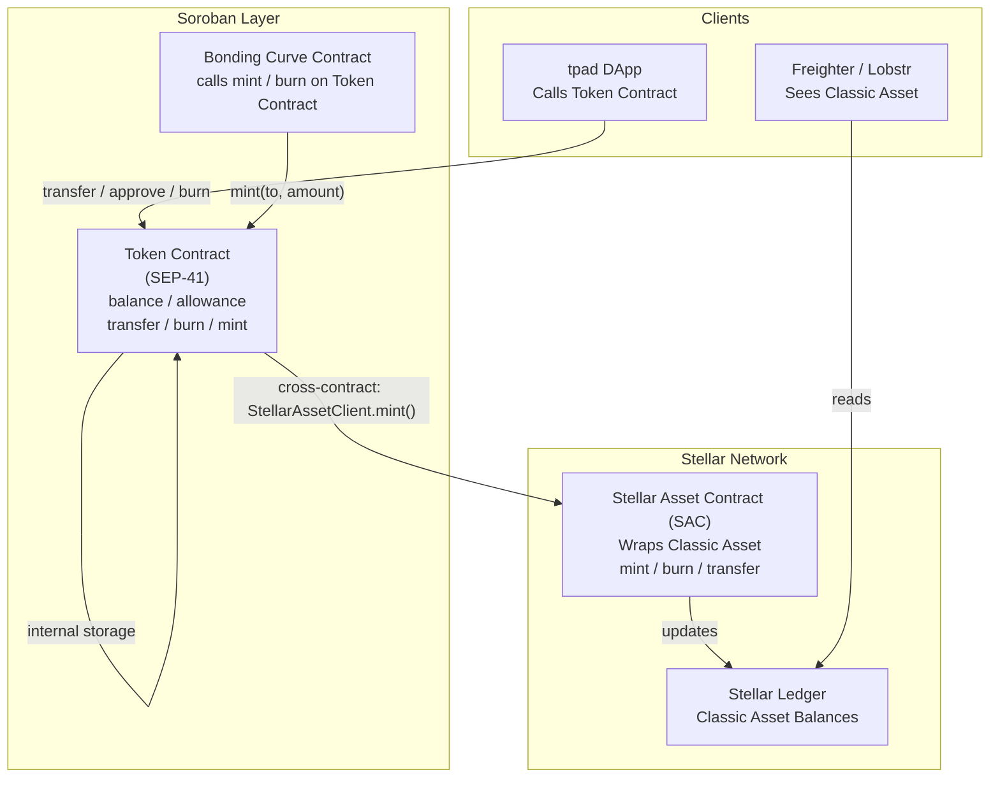
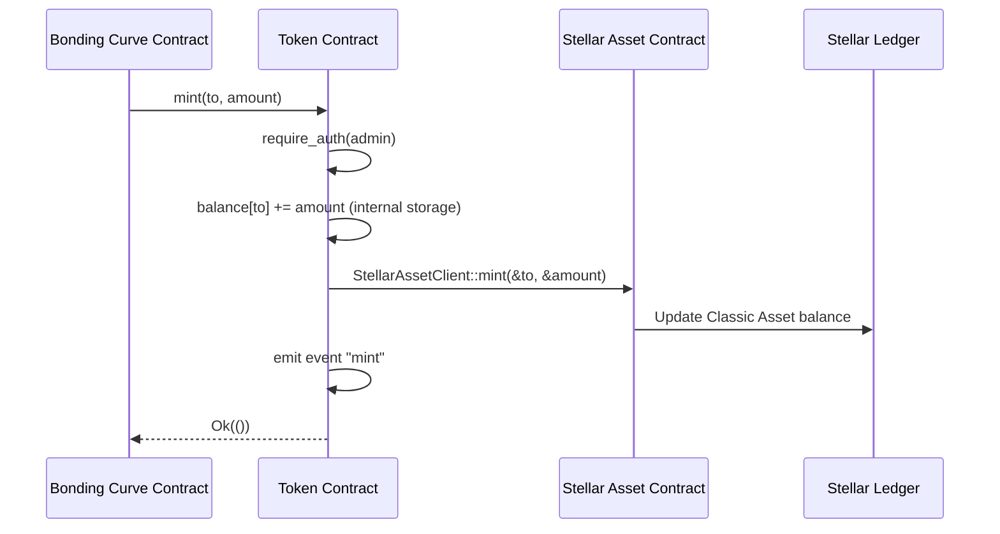

# Design Document: Soroban Token Contract (Hybrid Model)

## Overview

Token contract này implement **Hybrid Model** trên Stellar Soroban:

- **SEP-41 Token Interface** — toàn bộ logic token (balance, allowance, transfer, burn) được xử lý bởi Soroban contract
- **SAC (Stellar Asset Contract) Integration** — khi mint, contract gọi cross-contract call vào SAC để token xuất hiện như Stellar Asset thật trong ví người dùng (Freighter, Lobstr, v.v.)

Người dùng thấy token như một Stellar Classic Asset bình thường, trong khi bonding curve và DeFi logic chạy hoàn toàn trên Soroban.

**Workspace:** `stellar.tpad/contracts/token/`  
**Language:** Rust + `soroban-sdk`  
**Target:** Stellar Testnet

---

## Architecture



**Luồng mint (quan trọng nhất):**
1. Bonding Curve contract (hoặc Admin) gọi `Token_Contract::mint(to, amount)`
2. Token Contract cộng `amount` vào internal balance storage
3. Token Contract gọi `StellarAssetClient::mint(&to, &amount)` trên SAC address đã lưu
4. SAC mint token thật vào ví `to` trên Stellar network
5. Người dùng thấy token trong Freighter/Lobstr

---

## Components and Interfaces

### Module Structure

```
stellar.tpad/contracts/token/
├── Cargo.toml
└── src/
    ├── lib.rs          # Contract entry point, #[contractimpl]
    ├── storage.rs      # Storage keys, read/write helpers
    ├── types.rs        # Error enum, event structs
    └── test.rs         # Unit tests + property tests
```

### SEP-41 Token Interface (Full)

```rust
pub trait TokenInterface {
    fn allowance(env: Env, from: Address, spender: Address) -> i128;
    fn approve(env: Env, from: Address, spender: Address, amount: i128, expiration_ledger: u32);
    fn balance(env: Env, id: Address) -> i128;
    fn transfer(env: Env, from: Address, to: Address, amount: i128);
    fn transfer_from(env: Env, spender: Address, from: Address, to: Address, amount: i128);
    fn burn(env: Env, from: Address, amount: i128);
    fn burn_from(env: Env, spender: Address, from: Address, amount: i128);
    fn decimals(env: Env) -> u32;
    fn name(env: Env) -> String;
    fn symbol(env: Env) -> String;
}
```

### Admin Interface (CAP-46-6 Extension)

```rust
// Không thuộc SEP-41, nhưng cần thiết cho Hybrid Model
fn initialize(env: Env, admin: Address, decimal: u32, name: String, symbol: String, sac: Address);
fn mint(env: Env, to: Address, amount: i128);
fn set_admin(env: Env, new_admin: Address);
fn admin(env: Env) -> Address;
```

### SAC Cross-Contract Client

```rust
// Sử dụng soroban_sdk::token::StellarAssetClient
// Chỉ dùng hàm mint() — không thuộc SEP-41
use soroban_sdk::token::StellarAssetClient;

let sac_client = StellarAssetClient::new(&env, &sac_address);
sac_client.mint(&to, &amount);
```

---

## Data Models

### Storage Keys

```rust
#[derive(Clone)]
#[contracttype]
pub enum DataKey {
    // Persistent storage — tồn tại vĩnh viễn
    Admin,                          // Address
    Decimals,                       // u32
    Name,                           // String
    Symbol,                         // String
    Sac,                            // Address (SAC contract address)
    Balance(Address),               // i128

    // Temporary storage — có TTL, dùng cho allowance
    Allowance(AllowanceKey),        // AllowanceValue
}

#[derive(Clone)]
#[contracttype]
pub struct AllowanceKey {
    pub from: Address,
    pub spender: Address,
}

#[derive(Clone)]
#[contracttype]
pub struct AllowanceValue {
    pub amount: i128,
    pub expiration_ledger: u32,
}
```

### Storage Strategy

| Key | Storage Type | Rationale |
|-----|-------------|-----------|
| `Admin` | Persistent | Không bao giờ expire |
| `Decimals` | Persistent | Metadata cố định |
| `Name` | Persistent | Metadata cố định |
| `Symbol` | Persistent | Metadata cố định |
| `Sac` | Persistent | SAC address cố định |
| `Balance(addr)` | Persistent | Balance không expire |
| `Allowance(key)` | Temporary | Expire theo `expiration_ledger` |

**Lưu ý về Temporary Storage:** Soroban temporary storage tự động expire khi ledger vượt TTL. Allowance được lưu với `extend_ttl` đến `expiration_ledger`. Khi query, nếu entry đã expire, trả về `0`.

### Error Types

```rust
#[contracterror]
#[derive(Copy, Clone, Debug, Eq, PartialEq, PartialOrd, Ord)]
#[repr(u32)]
pub enum TokenError {
    AlreadyInitialized      = 1,
    NotInitialized          = 2,
    Unauthorized            = 3,
    InvalidAmount           = 4,
    InsufficientBalance     = 5,
    InsufficientAllowance   = 6,
    InvalidExpirationLedger = 7,
}
```

### Events

```rust
// Transfer event
// topics: ["transfer", from: Address, to: Address]
// data:   amount: i128
env.events().publish(
    (symbol_short!("transfer"), from.clone(), to.clone()),
    amount,
);

// Approve event
// topics: ["approve", from: Address, spender: Address]
// data:   [amount: i128, expiration_ledger: u32]
env.events().publish(
    (symbol_short!("approve"), from.clone(), spender.clone()),
    (amount, expiration_ledger),
);

// Burn event
// topics: ["burn", from: Address]
// data:   amount: i128
env.events().publish(
    (symbol_short!("burn"), from.clone()),
    amount,
);

// Mint event
// topics: ["mint", admin: Address, to: Address]
// data:   amount: i128
env.events().publish(
    (symbol_short!("mint"), admin.clone(), to.clone()),
    amount,
);
```

---

## SAC Integration Flow



**Điều kiện tiên quyết để SAC mint hoạt động:**
1. Token Contract phải được set làm **authorized minter** trên SAC (thực hiện off-chain khi setup)
2. SAC address phải được lưu trong `initialize`
3. Stellar Classic Asset phải tồn tại trước (issuer account tạo asset)

**Setup sequence (off-chain, một lần):**
```bash
# 1. Tạo Classic Asset trên testnet
stellar keys generate issuer --network testnet

# 2. Deploy SAC cho asset
stellar contract id asset \
  --asset TOKEN:G<issuer> \
  --network testnet

# 3. Deploy Token Contract
stellar contract deploy \
  --wasm target/wasm32-unknown-unknown/release/token.wasm \
  --network testnet \
  --source admin

# 4. Initialize Token Contract với SAC address
stellar contract invoke \
  --id C<token_contract_id> \
  --network testnet \
  --source admin \
  -- initialize \
  --admin G<admin> \
  --decimal 7 \
  --name "My Token" \
  --symbol "MTK" \
  --sac C<sac_address>
```

---

## Error Handling

Theo SEP-41 spec, contract dùng **panic/trap** thay vì return `Result`. Tất cả error conditions đều `panic!` với `TokenError` enum.

| Scenario | Error | Function |
|----------|-------|----------|
| Initialize gọi lần 2 | `AlreadyInitialized` | `initialize` |
| Không có auth | `Unauthorized` | tất cả write functions |
| amount <= 0 | `InvalidAmount` | `transfer`, `burn`, `mint` |
| amount < 0 | `InvalidAmount` | `approve` |
| balance < amount | `InsufficientBalance` | `transfer`, `transfer_from`, `burn`, `burn_from` |
| allowance < amount | `InsufficientAllowance` | `transfer_from`, `burn_from` |
| expiration_ledger < current | `InvalidExpirationLedger` | `approve` (khi amount > 0) |

**Pattern xử lý lỗi:**
```rust
if amount <= 0 {
    panic_with_error!(&env, TokenError::InvalidAmount);
}
```

---

## Correctness Properties

*A property is a characteristic or behavior that should hold true across all valid executions of a system — essentially, a formal statement about what the system should do. Properties serve as the bridge between human-readable specifications and machine-verifiable correctness guarantees.*

### Property 1: Transfer Balance Conservation

*For any* two distinct addresses `from` and `to`, and any valid amount where `balance(from) >= amount > 0`, after calling `transfer(from, to, amount)`, the sum `balance(from) + balance(to)` must equal the sum before the transfer.

**Validates: Requirements 4.3, 4.7**

### Property 2: Transfer Balance Delta

*For any* valid transfer of `amount` from `from` to `to`, `balance(from)` decreases by exactly `amount` and `balance(to)` increases by exactly `amount`.

**Validates: Requirements 4.3, 4.7**

> *Reflection: Property 2 is strictly stronger than Property 1 (it implies conservation). Property 1 is subsumed — keeping Property 2 only.*

### Property 3: Approve Round-Trip

*For any* `from`, `spender`, non-negative `amount`, and valid `expiration_ledger >= current_ledger`, after calling `approve(from, spender, amount, expiration_ledger)`, querying `allowance(from, spender)` must return exactly `amount`.

**Validates: Requirements 3.3**

### Property 4: Allowance Expiration

*For any* allowance set with `expiration_ledger < current_ledger` (expired), querying `allowance(from, spender)` must return `0`.

**Validates: Requirements 3.6**

### Property 5: Transfer From Reduces Allowance

*For any* valid `transfer_from(spender, from, to, amount)` where `allowance(from, spender) >= amount`, after the call, `allowance(from, spender)` must equal `allowance_before - amount`.

**Validates: Requirements 5.3, 5.4**

### Property 6: Burn Reduces Balance

*For any* address `from` and valid `amount` where `balance(from) >= amount > 0`, after calling `burn(from, amount)`, `balance(from)` must equal `balance_before - amount`.

**Validates: Requirements 6.3**

### Property 7: Mint Increases Balance

*For any* address `to` and `amount > 0`, after calling `mint(to, amount)`, `balance(to)` must equal `balance_before + amount`.

**Validates: Requirements 8.3, 8.7**

### Property 8: Mint-Burn Round Trip

*For any* address `to` and `amount > 0`, calling `mint(to, amount)` followed by `burn(to, amount)` must return `balance(to)` to its original value.

**Validates: Requirements 11.5**

> *Reflection: Property 8 is implied by Properties 6 and 7 combined. However, it is kept explicitly because Requirement 11.5 mandates it as a named property test.*

### Property 9: Burn From Reduces Allowance

*For any* valid `burn_from(spender, from, amount)` where `allowance(from, spender) >= amount`, after the call, `allowance(from, spender)` must equal `allowance_before - amount`.

**Validates: Requirements 7.3, 7.4**

> *Reflection: Properties 5 and 9 are structurally identical (both test allowance reduction). They are kept separate because they test different functions (`transfer_from` vs `burn_from`) and both are explicitly required.*

---

## Testing Strategy

### Property-Based Testing Library

Dùng **`proptest`** (crate `proptest = "1"`) — Hypothesis-like framework cho Rust, hỗ trợ shrinking. Stellar docs cũng recommend proptest cho Soroban fuzzing.

Mỗi property test chạy tối thiểu **100 iterations** (proptest default).

### Test Structure

```
src/test.rs
├── Unit Tests (example-based)
│   ├── test_initialize_success
│   ├── test_initialize_twice_fails
│   ├── test_balance_default_zero
│   ├── test_allowance_default_zero
│   ├── test_approve_and_query
│   ├── test_transfer_success
│   ├── test_transfer_insufficient_balance
│   ├── test_transfer_from_success
│   ├── test_transfer_from_insufficient_allowance
│   ├── test_burn_success
│   ├── test_burn_from_success
│   ├── test_mint_success
│   ├── test_set_admin_success
│   ├── test_set_admin_unauthorized
│   └── test_allowance_expiration
│
└── Property Tests (proptest)
    ├── prop_transfer_balance_delta          # Property 2
    ├── prop_approve_round_trip              # Property 3
    ├── prop_allowance_expiration            # Property 4
    ├── prop_transfer_from_reduces_allowance # Property 5
    ├── prop_burn_reduces_balance            # Property 6
    ├── prop_mint_increases_balance          # Property 7
    ├── prop_mint_burn_round_trip            # Property 8
    └── prop_burn_from_reduces_allowance     # Property 9
```

### Property Test Template

```rust
// Feature: soroban-token-contract, Property 2: Transfer Balance Delta
proptest! {
    #[test]
    fn prop_transfer_balance_delta(
        initial_from in 1_i128..1_000_000_i128,
        amount in 1_i128..500_000_i128,
    ) {
        prop_assume!(initial_from >= amount);
        let env = Env::default();
        env.mock_all_auths();
        // setup contract, mint initial_from to `from`
        // record balances before
        // call transfer
        // assert balance(from) == before - amount
        // assert balance(to) == before + amount
    }
}
```

### Unit Test Setup Pattern

```rust
#[cfg(test)]
mod test {
    use super::*;
    use soroban_sdk::{testutils::Address as _, Env};
    use soroban_sdk::token::StellarAssetClient;

    fn setup() -> (Env, TokenContractClient, Address, Address) {
        let env = Env::default();
        env.mock_all_auths();
        let admin = Address::generate(&env);
        // register SAC mock
        let sac = env.register_stellar_asset_contract_v2(admin.clone());
        let contract_id = env.register(TokenContract, ());
        let client = TokenContractClient::new(&env, &contract_id);
        client.initialize(
            &admin,
            &7u32,
            &String::from_str(&env, "My Token"),
            &String::from_str(&env, "MTK"),
            &sac.address(),
        );
        (env, client, admin, sac.address())
    }
}
```

### Dual Testing Approach

| Test Type | Scope | Tool |
|-----------|-------|------|
| Unit tests | Specific examples, error cases, auth checks | `#[test]` + `soroban_sdk::testutils` |
| Property tests | Universal invariants, conservation laws | `proptest` |
| Integration | SAC cross-contract call | `register_stellar_asset_contract_v2` |

---

## Build & Deploy Steps

### Cargo.toml Configuration

```toml
[package]
name = "token"
version = "0.1.0"
edition = "2021"

[lib]
crate-type = ["cdylib"]

[dependencies]
soroban-sdk = { version = "22.0", features = ["alloc"] }

[dev-dependencies]
soroban-sdk = { version = "22.0", features = ["testutils"] }
proptest = "1"

[profile.release]
opt-level = "z"
overflow-checks = true
debug = 0
strip = "symbols"
debug-assertions = false
panic = "abort"
codegen-units = 1
lto = true
```

### Build

```bash
# Từ thư mục stellar.tpad/contracts/token/
stellar contract build

# Output: target/wasm32-unknown-unknown/release/token.wasm
```

### Run Tests

```bash
cargo test
```

### Deploy lên Testnet

```bash
# 1. Fund account
stellar keys generate admin --network testnet
stellar keys fund admin --network testnet

# 2. Deploy contract
stellar contract deploy \
  --wasm target/wasm32-unknown-unknown/release/token.wasm \
  --source admin \
  --network testnet

# Output: C<56-char contract ID>

# 3. Initialize
stellar contract invoke \
  --id C<contract_id> \
  --source admin \
  --network testnet \
  -- initialize \
  --admin $(stellar keys address admin) \
  --decimal 7 \
  --name "TPad Token" \
  --symbol "TPAD" \
  --sac C<sac_address>

# 4. Lưu contract ID
echo "TOKEN_CONTRACT_ID=C<contract_id>" >> stellar.tpad/.env.local
```

### Verify Deploy

```bash
stellar contract invoke \
  --id C<contract_id> \
  --network testnet \
  -- symbol
# Output: "TPAD"
```
