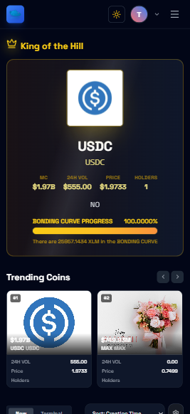

# Stellar TPad

**A state-of-the-art token launchpad built on Stellar Soroban with advanced on-chain bonding curves and production-ready architecture.**

---

### 🌐 Live Production Demo
**👉 [https://stellartpad-production.up.railway.app/](https://stellartpad-production.up.railway.app/)**

---

<div align="center">

[](https://github.com/vantuann205/stellar.tpad/actions/workflows/ci.yml)
[](https://nextjs.org/)
[](https://www.typescriptlang.org/)
[](https://soroban.stellar.org/)
[](https://stellar.org/)
[](https://www.postgresql.org/)

</div>

---

## 🏆 Contest Overview & Focus

### 👉 Level Overview
We have prepared this application for production with continuous integration, on-chain contract optimizations, responsive mobile layouts, and complete error tracking.

* **Focus:** Advanced contract patterns and production readiness
* **Key Learning Achievements:**
  * **Inter-contract calls:** Orchestrating dynamic deployment and cross-contract state registration.
  * **Custom token creation & liquidity pool mechanics:** On-chain linear bonding curves and SEP-41 standard custom mints.
  * **Advanced event streaming (real-time):** Instant data synchronization and metrics calculation.
  * **CI/CD pipeline setup:** Fully automated quality checking of smart contracts and frontend.
  * **Mobile responsive design:** Sleek viewport adaptation for on-the-go traders.

---

## ✅ Level 6 Submission Checklist

| Requirement | Status | Evidence |
|---|---:|---|
| Public GitHub repository | ✅ | [vantuann205/stellar.tpad](https://github.com/vantuann205/stellar.tpad) |
| Minimum 30+ meaningful commits | ✅ | [Commit history](https://github.com/vantuann205/stellar.tpad/commits/main/) |
| Live Mainnet application | ✅ | [Railway production](https://stellartpad-production.up.railway.app/) |
| Mainnet contract addresses | ✅ | [Factory](https://stellar.expert/explorer/public/contract/CDR6H3FZCMB2HASOBXL4UTZ2SKAAUWY27N6CS3OGZMXB6NOWS7V6ILLU) · [Bonding curve](https://stellar.expert/explorer/public/contract/CDMZM67NNMUJZLBNR3PXDHDZFZOQQSGC66M7PVIGGIAH36NMN4RVADHY) · [TPAD token](https://stellar.expert/explorer/public/contract/CDFLPOHFVWBNRWKKAFDDPOI66AXP76CFBI5IAUDSZBSF7PMEAJOLOIGR) · [OSPK](https://stellar.expert/explorer/public/contract/CALWP4NNY2GN6A2ADVXJFAFL4VVFAD4Q6OFW2K7JTRUBOWRHY5WGDRJ6) · [LDRF](https://stellar.expert/explorer/public/contract/CCUHLAYS2RWEM5BEOJNU26ZAQSD5LDE62DUYHRVYE6LPU5QJMYYVFOX5) |
| Proof of 20+ Mainnet users | ✅ | [25 Mainnet accounts with verified buy/sell activity](./MAINNET_USERS.md) |
| Transaction activity proof | ✅ | [Mainnet transactions](#mainnet-transaction-proof) |
| Audit/security review proof | ✅ | [Security review](./SECURITY_REVIEW.md) · [CI checks](https://github.com/vantuann205/stellar.tpad/actions) |
| Twitter/X launch post | ✅ | [@stellartpad](https://x.com/stellartpad) |
| Demo video | ✅ | [Full product walkthrough](https://drive.google.com/file/d/1DI_LoeVH-k2d0CMGWDXHC_YuHI2ehuRl/view?usp=drive_link) |
| Technical documentation | ✅ | [Architecture](#-soroban-production-ready-optimizations) · [contracts](#-on-chain-contract-addresses-stellar-mainnet) |
| User guide/documentation | ✅ | [User guide](./USER_GUIDE.md) |
| Community contribution link | ✅ | [Open-source repository](https://github.com/vantuann205/stellar.tpad) |

### Mainnet transaction proof

| Action | Transaction |
|---|---|
| Upload token WASM | [`6686ae89…fc21`](https://stellar.expert/explorer/public/tx/6686ae899e61197affdae844fe5dd85f81f22ab111eeacc6459f2e80098efc21) |
| Upload bonding-curve WASM | [`891d7a45…2191`](https://stellar.expert/explorer/public/tx/891d7a455dc85135a265d618e54a32284b893933fc40bb1e493c8f3b56f52191) |
| Upload factory WASM | [`823a251f…4279`](https://stellar.expert/explorer/public/tx/823a251f240f21678f5df1a021634c22b58f53488dd05ba6def48a4c289e4279) |
| Deploy bonding curve | [`7ce2828a…965d`](https://stellar.expert/explorer/public/tx/7ce2828a3a0a3db7be75457be7db69f00736d38d1b5e71b1cc0c9e24f06e965d) |
| Deploy factory | [`65eddfb3…cdf8`](https://stellar.expert/explorer/public/tx/65eddfb3c0abf3bc04d79d483d4629dc58cc3a02f782d89646e054157579cdf8) |
| Create TPAD token | [`527369f7…1b9`](https://stellar.expert/explorer/public/tx/527369f79dc343ddd75d0f4b4a3a78bb854656662e0dd98001a192041bf7a1b9) |
| Create Orbit Spark (OSPK) | [`e4e7ad16…a05d`](https://stellar.expert/explorer/public/tx/e4e7ad163ae407b40c8ab16f5b1a04052097c2e94b95bcf44d4c2459ff66a05d) |
| Create Lumen Drift (LDRF) | [`88fbdef1…37d5`](https://stellar.expert/explorer/public/tx/88fbdef1eabdc1083c3e47cb027d34e9f5628e5c143be4b2c707779d730337d5) |
| 25-account buy/sell activity | [52 verified Mainnet transaction records](./MAINNET_USERS.md#verified-mainnet-activity) |

---

## 📱 Mobile Responsive View

Here is the live interface optimized for mobile viewports, featuring real-time price updates and smooth linear bonding curve progress indicators:

<div align="center">
  
</div>

---

## 🔗 On-Chain Contract Addresses (Stellar Mainnet)

* **Token Factory Contract:** [`CDR6H3FZCMB2HASOBXL4UTZ2SKAAUWY27N6CS3OGZMXB6NOWS7V6ILLU`](https://stellar.expert/explorer/public/contract/CDR6H3FZCMB2HASOBXL4UTZ2SKAAUWY27N6CS3OGZMXB6NOWS7V6ILLU)
* **Bonding Curve Contract:** [`CDMZM67NNMUJZLBNR3PXDHDZFZOQQSGC66M7PVIGGIAH36NMN4RVADHY`](https://stellar.expert/explorer/public/contract/CDMZM67NNMUJZLBNR3PXDHDZFZOQQSGC66M7PVIGGIAH36NMN4RVADHY)
* **TPAD Token Contract:** [`CDFLPOHFVWBNRWKKAFDDPOI66AXP76CFBI5IAUDSZBSF7PMEAJOLOIGR`](https://stellar.expert/explorer/public/contract/CDFLPOHFVWBNRWKKAFDDPOI66AXP76CFBI5IAUDSZBSF7PMEAJOLOIGR)
* **Orbit Spark (OSPK):** [`CALWP4NNY2GN6A2ADVXJFAFL4VVFAD4Q6OFW2K7JTRUBOWRHY5WGDRJ6`](https://stellar.expert/explorer/public/contract/CALWP4NNY2GN6A2ADVXJFAFL4VVFAD4Q6OFW2K7JTRUBOWRHY5WGDRJ6)
* **Lumen Drift (LDRF):** [`CCUHLAYS2RWEM5BEOJNU26ZAQSD5LDE62DUYHRVYE6LPU5QJMYYVFOX5`](https://stellar.expert/explorer/public/contract/CCUHLAYS2RWEM5BEOJNU26ZAQSD5LDE62DUYHRVYE6LPU5QJMYYVFOX5)
* **Native XLM SAC:** `CAS3J7GYLGXMF6TDJBBYYSE3HQ6BBSMLNUQ34T6TZMYMW2EVH34XOWMA`
* **Token WASM Hash:** `547a076fedf192ebf3fc0d274ca80fdc578c6a2c02176643554ffe46a45843da`

---

## ⚡ Soroban Production-Ready Optimizations

### 1. Inter-Contract Call Flow
When a user launches a new token, the following atomic steps occur on the Stellar network:
```
+------------------+    deploys    +------------------+
|  TokenFactory    |-------------->|  TokenContract   | (SEP-41 Mint)
|  create_token()  |               |  (1 Billion MTK) |
+--------+---------+               +------------------+
         |
         |  invokes (cross-contract)
         v
+------------------------+
|  BondingCurveContract  | (Saves state, initializes
|  register_token()      |  bonding parameters)
+------------------------+
```

### 2. Soroban Storage TTL Extension (Preventing State Expiration)
Soroban state entries will archive if their Time-To-Live (TTL) is not extended. To prevent production lockout, active read/write functions call `extend_ttl`:
- **Token Contract (`storage.rs`):** Automatically bumps the balance, name, and symbol persistent keys dynamically on reads/writes.
- **Bonding Curve (`lib.rs`):** Extends instance and persistent entry lifetimes for all token registered states during buys/sells.

---

## 🛠️ Technology Stack Overview

| Layer | Technology |
|---|---|
| **Frontend Framework** | Next.js 14 (App Router), React 18, TypeScript 5 |
| **Styling & Icons** | Tailwind CSS 3, Lucide React |
| **Charts** | Lightweight Charts (TradingView style), Recharts |
| **Smart Contract Engine** | Rust (`no_std`), Soroban SDK v22 |
| **Blockchain Client** | `@stellar/stellar-sdk` v15, StellarWalletsKit |
| **Database & Cache** | PostgreSQL (Neon serverless pg pool) |
| **Asset Storage** | Cloudinary CDN |
| **State Store** | Zustand |

---

## 📂 Project Directory Structure

```
stellar-tpad/
├── .github/workflows/ci.yml          # Automated CI/CD Pipeline
├── Dockerfile                        # Multi-stage production container build
├── railway.toml                      # Railway production deployment config
│
└── stellar.tpad/                     # Next.js 14 Frontend & API
    ├── src/
    │   ├── app/                      # Next.js Pages & Routes
    │   │   ├── page.tsx              # Main Dashboard
    │   │   ├── api/                  # Backend endpoints (search, comments, purchases)
    │   │   └── token/[contractAddress] # Detailed trading page shell
    │   ├── components/               # UI components (charts, traders, lists)
    │   ├── services/                 # Freighter and wallet connectors
    │   ├── store/                    # Zustand global state (wallet, session)
    │   └── lib/                      # DB connectors and metric calculators
    │
    ├── contracts/                    # Soroban Smart Contracts (Rust)
    │   ├── bonding_curve/            # On-chain linear pricing, buys, and sells
    │   ├── token/                    # Custom mintable SEP-41 token
    │   └── factory/                  # Cross-contract deployer and registrar
    │
    └── instrumentation.ts            # Bootstraps serverless database keepalives
```

---

## 🚀 Getting Started & Local Development

### 1. Step-by-Step Installation

```bash
# Clone the repository
git clone https://github.com/vantuann205/stellar.tpad.git
cd stellar.tpad/stellar.tpad

# Install dependencies
npm install --legacy-peer-deps

# Configure environment variables
cp .env.local.example .env.local

# Bootstrap DB tables & migrations
npm run init-db

# Launch local server
npm run dev
```

The application will run locally on **[http://localhost:3000](http://localhost:3000)**!

### 2. Testing Smart Contracts Locally

```bash
# Run Rust smart contract test suite
cd stellar.tpad/contracts/bonding_curve
cargo test

cd ../token
cargo test
```

---

## 📄 License
Licensed under the **MIT License**. Created with 💜 by the Stellar TPad Team.
